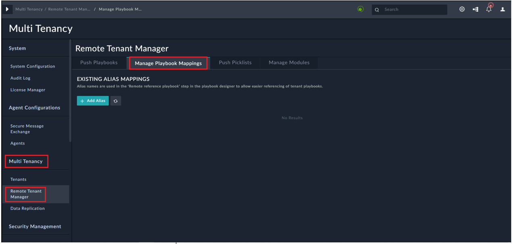
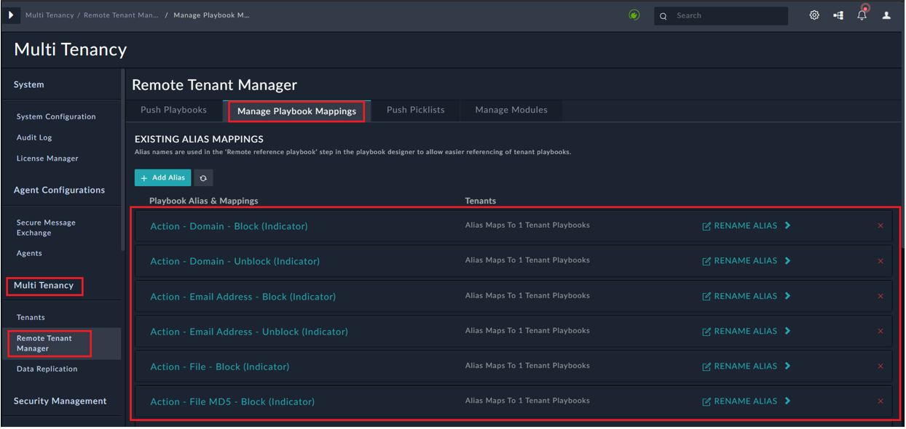

| [Home](https://github.com/fortinet-fortisoar/solution-pack-multi-tenancy/blob/develop/README.md) |
|--------------------------------------------------------------------------------------------------|

# Installation 
1. To install a solution pack, click **Content Hub** > **Discover**.    
2. From the list of solution pack that appears, search for and select **Multi Tenancy Addons**. 
3. Click the **Multi Tenancy Addons** solution pack card.    
4. Click the **Install** button on the bottom to begin installation. 
 
## Prerequisites 
The **Multi Tenancy Addons** solution pack depends on the following solution packs.

| Solution Pack Name | Purpose                                |
|:-------------------|:---------------------------------------|
| SOAR Framework     | Required for Incident Response modules |

>**Important**: You must install Multi Tenancy Addons solution pack on both the **Master** and the **Tenant** nodes.

# Configuration 
For optimal performance of **Multi Tenancy Addons** solution pack, enable the remote execution flag for all the playbooks in *04-Actions (Remote)* collection on the Tenant systems by executing the **Enable Remote Execution Flag(Tenant Only)** playbook as follows:

1. Open the FortiSOAR Tenant instance, and from the navigation panel, click the **Alerts** module.
2. Click **Execute** and then select **Enable Remote Execution Flag (Tenant Only)**.  
    >**Important**: Before you execute the **Enable Remote Execution Flag (Tenant Only)** playbook, ensure that there is no **Playbook Mappings** in **Remote Tenant Manager** under **Multitenancy Section** on the Master node.

      

3. After the **Enable Remote Execution Flag (Tenant Only)** playbook is executed, **Playbook Mappings** is added in **Remote Tenant Manager** under **Multitenancy Section** on the Master node.  

    
