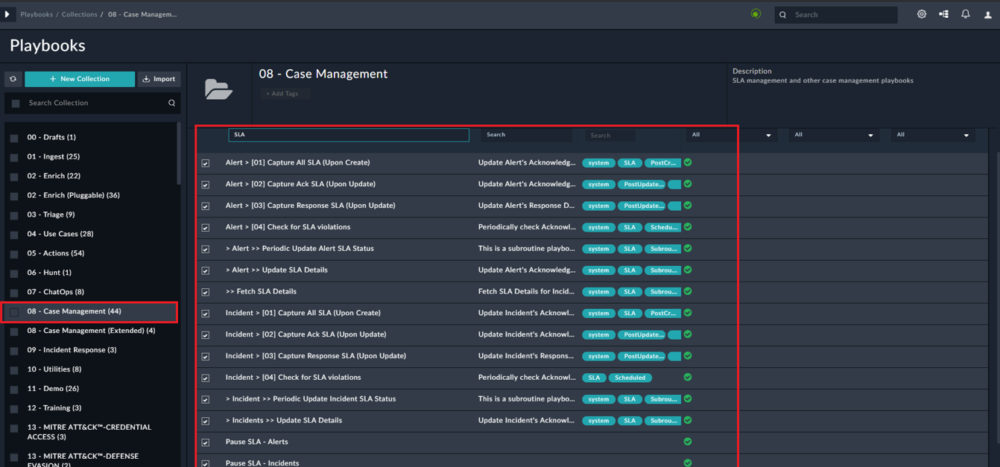
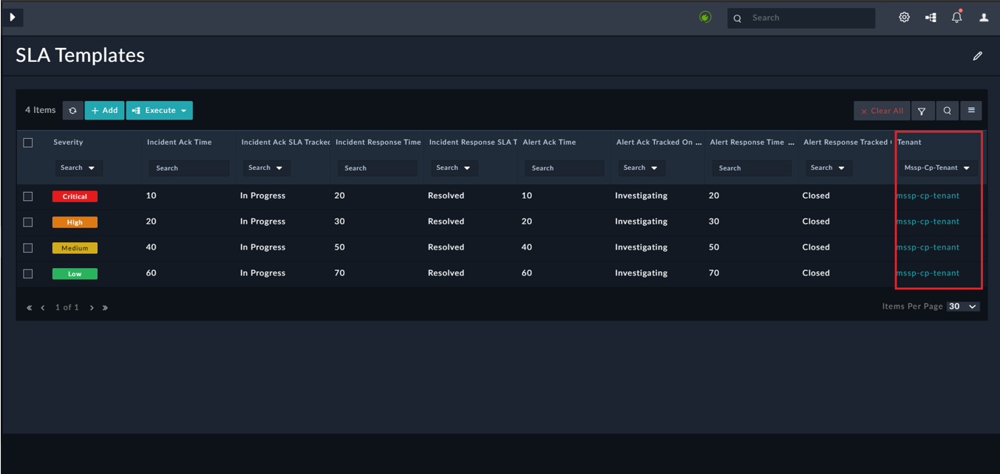

| [Home](https://github.com/fortinet-fortisoar/solution-pack-multi-tenancy/blob/develop/README.md) |
|--------------------------------------------------------------------------------------------------|

# Usage

1. Map Aliases of remote actions playbooks on the Master node by executing the **Remote Alias Mapping (Master)** playbook as follows:
    1. From the navigation panel,click the **Alerts** module.
    2. Click **Execute** and then select **Remote Alias Mapping (Master Only)**.

2. Disable SLA Playbooks from the *06 - IRP - Case Management* collection on the Tenant (keyword -> *SLA*). This is required because, SLA operations on all records &ndash; Master or Tenant &ndash; are performed on the Master.

    

3. Define Tenant SLA by adding SLA records for the Tenant in the **SLA Templates** module on the Master instance.

   
